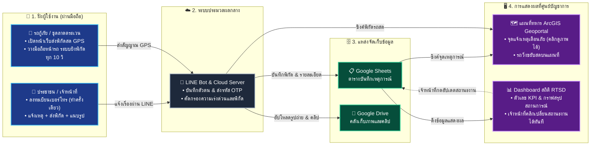

# 🧭 ผังการทำงานฉบับเข้าใจง่าย (RTSD Simple Workflow)
### ระบบแจ้งเหตุเตือนภัย • ติดตามสถานะ • แทร็กกิ้งพิกัดสด • กรมแผนที่ทหาร

---

## 🎯 ภาพรวมใน 4 ขั้นตอน (จากมือถือ ➔ สู่ศูนย์บัญชาการ)

---

## 📌 อธิบายง่ายๆ 4 สเต็ป:

| ขั้นตอน | ใครทำอะไร? | สิ่งที่เกิดขึ้นในระบบ |
| :--- | :--- | :--- |
| **1. แจ้งเรื่อง / ส่งพิกัด** | • **ประชาชน:** เปิด LINE กดเลือกเหตุการณ์ (น้ำท่วม, ไฟไหม้ ฯลฯ) ส่งพิกัดและถ่ายรูปแนบมา • **พลขับ/เจ้าหน้าที่สนาม:** เปิดหน้าเว็บแทร็กกิ้งบนมือถือ แล้วขับรถออกปฏิบัติงาน | ไม่ต้องติดตั้งแอปเพิ่ม ใช้งานผ่าน LINE และเบราว์เซอร์มือถือได้ทันที |
| **2. ระบบคัดกรองอัตโนมัติ** | • **ระบบ Cloud & AI:** ตรวจจับเบอร์โทรและชื่อผู้แจ้ง • แยกประเภทเหตุการณ์ จัดระดับความเร่งด่วน (🔴วิกฤต, 🟡ปานกลาง, 🟢เฝ้าระวัง) | ส่งรหัส OTP ให้ยืนยันตัวตนได้ ป้องกันข้อมูลเท็จ |
| **3. บันทึกและสำรองข้อมูล** | • ข้อมูลข้อความและพิกัดจะถูกเก็บลงตาราง **Google Sheets** • ไฟล์รูปถ่ายและคลิปวิดีโอจะถูกเก็บเข้าโฟลเดอร์ **Google Drive** ปลอดภัย | ฐานข้อมูลเป็นระเบียบ ไม่สูญหาย ค้นหาย้อนหลังได้ทันที |
| **4. แสดงผลที่ศูนย์บัญชาการ** | • **บนแผนที่ทหาร (ArcGIS Portal):** เห็นจุดหมุดแจ้งเตือนภัยคลิกดูรูปได้ และเห็นรถวิ่งขยับตามจริง • **บนหน้า Dashboard สถิติ:** แสดงตัวเลขสรุป กราฟแนวโน้ม และมีปุ่มให้เจ้าหน้าที่กดเปลี่ยนสถานะ (รอดำเนินการ ➔ กำลังทำ ➔ เสร็จสิ้น) | ผู้บังคับบัญชาเห็นภาพรวมสถานการณ์แบบเรียลไทม์ วางแผนสั่งการได้ทันที |
