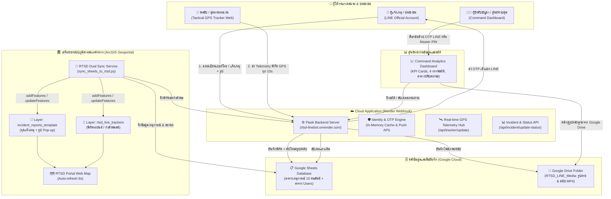
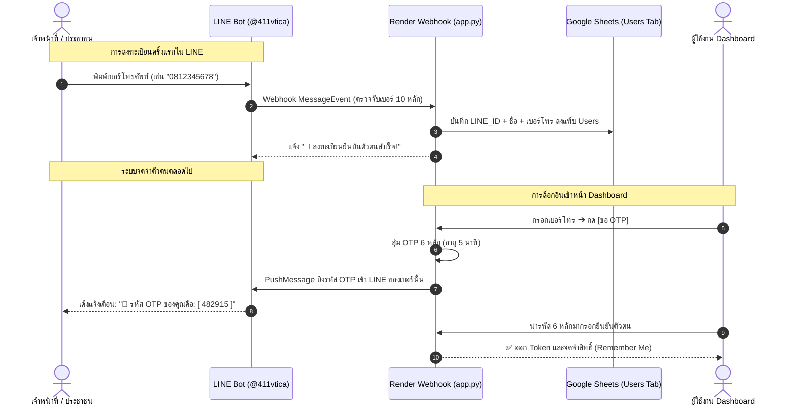
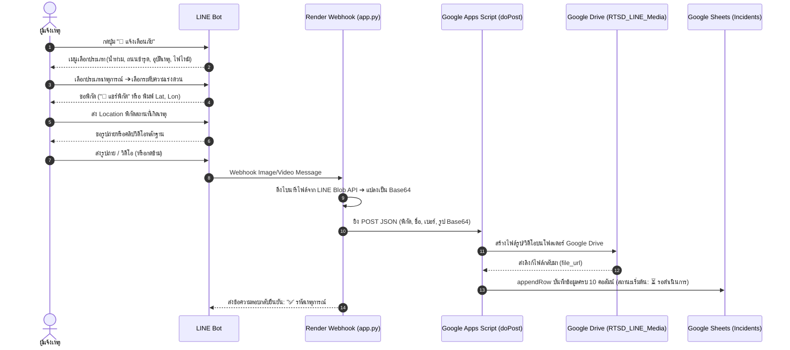
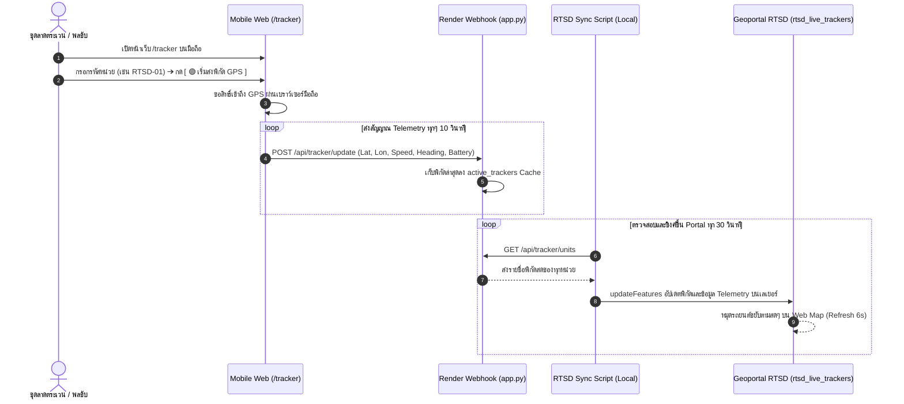
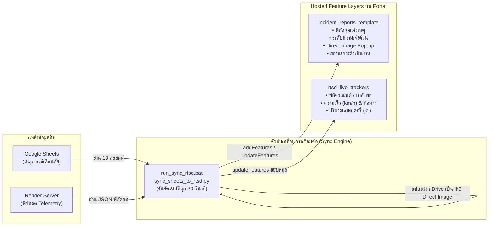
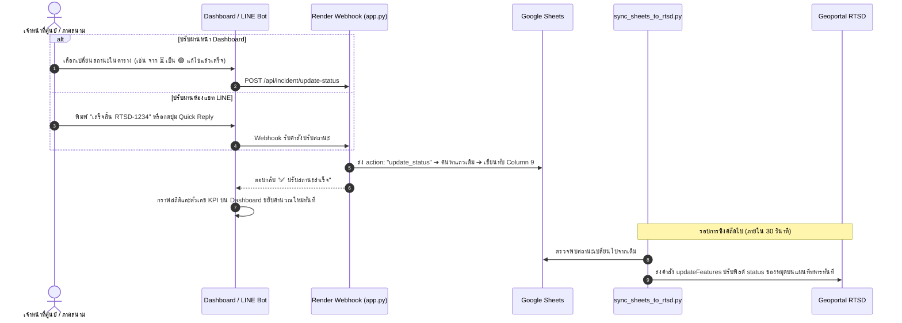

# 🗺️ แผนผังกระบวนการทำงานแบบครบวงจร (RTSD End-to-End System Workflow)
### ศูนย์ติดตามสถานการณ์ แจ้งเตือนภัย และแทร็กกิ้งพิกัดสด กรมแผนที่ทหาร

---

## 1. แผนภาพสถาปัตยกรรมระบบภาพรวม (High-Level Architecture)

ระบบประกอบด้วย **3 กลุ่มผู้ใช้งานหลัก** เชื่อมโยงผ่าน **Cloud Webhook API**, **คลาวด์จัดเก็บข้อมูล**, และ **ศูนย์บัญชาการแผนที่ทหาร**:

---

## 2. ลำดับขั้นตอนการทำงานแบบละเอียด (Step-by-Step Lifecycle)

---

### 🔹 ขั้นตอนที่ 1: การยืนยันตัวตนและการลงทะเบียน (Identity & OTP Flow)
> ทำเพียง **1 ครั้ง** ระบบจะจดจำตัวตนถาวร

---

### 🔹 ขั้นตอนที่ 2: การแจ้งเหตุการณ์เตือนภัย (Incident Reporting & Media Flow)

---

### 🔹 ขั้นตอนที่ 3: ระบบแทร็กกิ้งพิกัดสดภาคสนาม (Tactical Live GPS Flow)

---

### 🔹 ขั้นตอนที่ 4: การซิงค์และแสดงผลบน ArcGIS Geoportal RTSD

---

### 🔹 ขั้นตอนที่ 5: การควบคุมและปรับสถานะเหตุการณ์เดิม (Status Lifecycle Flow)

เมื่อเจ้าหน้าที่เข้าแก้ไขเหตุการณ์ สามารถสั่งเปลี่ยนสถานะได้จาก **Dashboard** หรือ **LINE Bot**:

---

## 3. สรุปความสัมพันธ์ของทั้งระบบ (System Components Matrix)

| ส่วนประกอบ | หน้าที่หลัก | เทคโนโลยีที่ใช้ | ปลายทางการแสดงผล |
| :--- | :--- | :--- | :--- |
| **LINE Official Account** | ติดต่อประชาชน, รับแจ้งเหตุ, ยืนยันตัวตน, ส่ง OTP, รับคำสั่งปรับสถานะ | LINE Messaging API v3, Python Flask | มือถือของประชาชนและเจ้าหน้าที่ |
| **Tactical GPS Tracker** | ส่งพิกัดรถยนต์และกำลังพลสด (ความเร็ว, ทิศทาง, แบตเตอรี่) | HTML5 Geolocation API, Tailwind CSS | เบราว์เซอร์บนมือถือพลขับ |
| **Cloud Application Webhook** | ประมวลผลกลาง, ตรวจสอบ OTP, พักข้อมูล Telemetry | Flask, Gunicorn บน Render Cloud | `https://rtsd-linebot.onrender.com` |
| **Google Sheets & Drive** | ฐานข้อมูลหลัก 10 คอลัมน์ และคลังเก็บไฟล์รูป/วิดีโอ | Google Apps Script Web App | Google Sheets & Drive Folder |
| **RTSD Sync Service** | เชื่อมประสานข้อมูลระหว่าง Google Cloud และ ArcGIS Portal | Python REST API, Referer Token Auth | รันบนเครื่องคอมพิวเตอร์ศูนย์ควบคุม |
| **Geoportal RTSD** | แผนที่ภูมิสารสนเทศทหาร แสดงจุดเหตุการณ์และหมุดรถยนต์ขยับสด | ArcGIS Enterprise 10.61 Hosted Layers | Portal Map Viewer / Web AppBuilder |
| **Command Dashboard** | ศูนย์สถิติ, กราฟวิเคราะห์ KPI, ตารางควบคุมสถานะ, ยืนยันตัวตนด้วย OTP/PIN | Chart.js, Tailwind CSS, LocalStorage | หน้าจอ Executive Command Dashboard |
